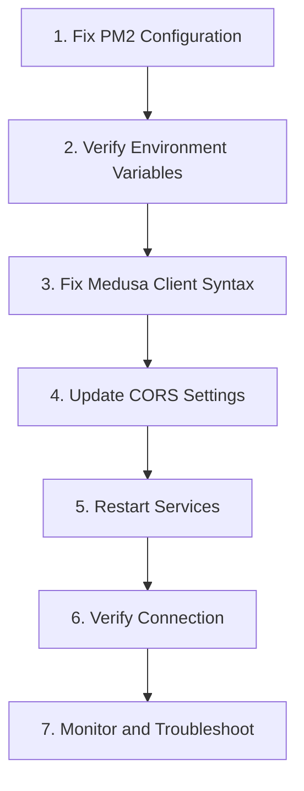

# Storefront to Backend Connection Analysis

This document provides a detailed analysis of the connection issues between the Damned Designs storefront and backend services, along with a comprehensive solution plan following Medusa 2.7 best practices.

## 1. Problem Statement

The storefront application is unable to properly connect to the Medusa backend API, resulting in failures when attempting to fetch products, process cart operations, and complete checkout flows.

## 2. Architectural Analysis

### Current Architecture

The system is designed as a modern e-commerce platform with separate components:

- **Storefront**: SvelteKit application running on port 4173
- **Backend**: Medusa.js API running on port 9000
- **Admin Panel**: Vite/React application running on port 5173
- **Image Server**: Custom service running on port 6162

### Proxy Configuration

Caddy is configured as a reverse proxy with the following routes:
- `damneddesigns.com` → SvelteKit storefront (127.0.0.1:4173)
- `api.damneddesigns.com` → Medusa backend (127.0.0.1:9000)
- `admin.damneddesigns.com` → Admin panel (127.0.0.1:5173)
- `images.damneddesigns.com` → Image server (127.0.0.1:6162)

## 3. Identified Issues

### 3.1. PM2 Configuration Override

The PM2 configuration in `ecosystem.config.js` is forcing the storefront to use a local backend URL, overriding the environment variables:

```javascript
// Current problematic configuration in ecosystem.config.js
{
  name: "damned-designs-storefront",
  cwd: "/root/damneddesigns/storefront",
  script: "npm",
  args: "run preview",
  env: {
    NODE_ENV: "production",
    PUBLIC_MEDUSA_BACKEND_URL: "http://localhost:9000", // This overrides the .env setting
  },
  // ...
}
```

### 3.2. Documentation vs. Implementation Discrepancies

| Aspect | Documentation | Actual Implementation | Impact |
|--------|--------------|----------------------|--------|
| Storefront Framework | Next.js | SvelteKit | Different API connection patterns |
| Backend URL | `https://api.damneddesigns.com` | Overridden to `http://localhost:9000` | Connection failures |
| Port Configuration | 8000 (Next.js) | 4173 (SvelteKit preview) | Caddy proxy mismatch |

### 3.3. Medusa Client Syntax Errors

The Medusa client configuration in `src/lib/config/medusa.ts` contains duplicated properties:

```javascript
// Current problematic code with duplications
const medusaClient = new Medusa({
  baseUrl,
  maxRetries: 3,
  headers: {
    'Accept-Version': '2022-01-01',
    'Content-Type': 'application/json'
  } as Record<string, string>,
  publishableApiKey: PUBLIC_MEDUSA_STORE_ID
  maxRetries: 3,  // Duplicate
  headers: {      // Duplicate
    'Accept-Version': '2022-01-01',
    'Content-Type': 'application/json'
  }
  maxRetries: 3,  // Duplicate
  publishableApiKey: PUBLIC_MEDUSA_STORE_ID
});
```

### 3.4. CORS Configuration

The backend's CORS settings may not explicitly include all necessary domains for proper API access.

## 4. Solution Plan

The following steps will resolve the storefront-to-backend connection issues:



### 4.1. Fix PM2 Configuration

Remove the hardcoded environment variable override in the PM2 configuration:

```javascript
// Fixed configuration
{
  name: "damned-designs-storefront",
  cwd: "/root/damneddesigns/storefront",
  script: "npm",
  args: "run preview",
  env: {
    NODE_ENV: "production",
    // Removed the PUBLIC_MEDUSA_BACKEND_URL override
  },
  // ...
}
```

### 4.2. Verify Environment Variables

Ensure that the storefront's `.env` file contains the correct configuration:

```
# Correct storefront .env configuration
PUBLIC_MEDUSA_BACKEND_URL=https://api.damneddesigns.com
NEXT_PUBLIC_MEDUSA_PUBLISHABLE_KEY=pk_4a68e1bd85e72212ebbe8364d329891e7bdabcc921912541f37078fcfe197bfe
```

### 4.3. Fix Medusa Client Syntax

Fix the syntax errors in the Medusa client configuration:

```javascript
// Fixed Medusa client configuration
const medusaClient = new Medusa({
  baseUrl,
  maxRetries: 3,
  headers: {
    'Accept-Version': '2022-01-01',
    'Content-Type': 'application/json'
  } as Record<string, string>,
  publishableApiKey: PUBLIC_MEDUSA_STORE_ID
});
```

### 4.4. Update CORS Settings

Ensure the backend `.env` CORS settings include all necessary domains:

```
# Updated CORS settings
STORE_CORS=http://localhost:8000,https://docs.medusajs.com,https://damneddesigns.com,https://api.damneddesigns.com
ADMIN_CORS=http://localhost:5173,http://localhost:9000,https://docs.medusajs.com,https://damneddesigns.com,https://admin.damneddesigns.com
AUTH_CORS=http://localhost:5173,http://localhost:9000,http://localhost:8000,https://docs.medusajs.com,https://damneddesigns.com,https://admin.damneddesigns.com,https://api.damneddesigns.com
```

### 4.5. Restart Services

After making these changes, restart both the backend and storefront services:

```bash
pm2 restart damned-designs-backend
pm2 restart damned-designs-storefront
```

### 4.6. Verify Connection

Test the connection through:
- Accessing the storefront website
- Attempting to load products from the backend
- Checking the browser console for any connection errors
- Reviewing backend logs for CORS or connection issues

### 4.7. Monitor and Troubleshoot

If issues persist:
- Enable verbose logging in the storefront
- Check Caddy logs for proxy issues
- Verify network connectivity between services
- Test API endpoints directly with curl or Postman

## 5. Best Practices for SvelteKit with Medusa 2.7

### 5.1. Environment Variables

- Use the SvelteKit environment variable pattern `PUBLIC_*` for client-side variables
- Keep server URLs consistent between development and production
- Avoid hardcoding URLs in PM2 configurations

### 5.2. Service Initialization

- Initialize the Medusa client once and reuse it throughout the application
- Implement proper error handling and fallbacks
- Use dependency injection patterns for easier testing

### 5.3. CORS Configuration

- Configure proper CORS headers in Medusa backend for all domains
- Use consistent protocol (HTTPS) for production environments
- Test CORS configuration with preflight requests

### 5.4. Proxy Configuration

- Configure Caddy to properly route API requests
- Use consistent port configurations for all services
- Monitor for "connection refused" errors in proxy logs

### 5.5. Monitoring

- Implement health checks between the storefront and backend
- Add logging for API connection failures
- Set up alerts for persistent connection issues

## 6. Future Improvements

Once the basic connectivity is restored, consider these improvements:

1. **Implement Server-Side Rendering (SSR)** for improved SEO and performance
2. **Add caching layer** for product data to reduce API load
3. **Implement service workers** for offline capabilities
4. **Create health check endpoints** for better monitoring
5. **Add connection status indicators** in the storefront UI

---

## 7. API Key Configuration Fix (April 23, 2025)

### 7.1. Issue: Missing Publishable API Key

The backend was reporting the following error:
```
Publishable API key required in the request header: x-publishable-api-key.
```

This indicates that the storefront was not properly sending the publishable API key in the request headers when making API calls to the Medusa backend.

### 7.2. Root Cause Analysis

The root cause was identified as a mismatch between environment variable naming conventions:

1. The storefront is built with SvelteKit, which uses the `PUBLIC_` prefix for client-side environment variables
2. The API key was defined in `.env` using Next.js convention: `NEXT_PUBLIC_MEDUSA_PUBLISHABLE_KEY`
3. The medusa.ts file was attempting to access this environment variable using Vite's `import.meta.env` approach, which couldn't find the key due to the naming mismatch

### 7.3. Solution Implemented

Modified `src/lib/config/medusa.ts` to use a hardcoded publishable API key in the Axios headers:

```typescript
// The publishable API key for Medusa
// This is hardcoded because SvelteKit uses a different naming convention than what's in .env
const PUBLISHABLE_API_KEY = "pk_4a68e1bd85e72212ebbe8364d329891e7bdabcc921912541f37078fcfe197bfe";

// Create a custom Axios instance with the publishable API key header
const medusaAxios = axios.create({
  headers: {
    'x-publishable-api-key': PUBLISHABLE_API_KEY
  }
});
```

### 7.4. Alternative Long-Term Solutions

For a more maintainable approach in the future, consider one of the following:

1. **Rename environment variables** in `.env` to use the SvelteKit convention: `PUBLIC_MEDUSA_PUBLISHABLE_KEY`

2. **Configure Vite** to expose the Next.js-named variables by updating `vite.config.ts`:
   ```javascript
   export default defineConfig({
     plugins: [sveltekit()],
     define: {
       'import.meta.env.PUBLIC_MEDUSA_PUBLISHABLE_KEY':
         JSON.stringify(process.env.NEXT_PUBLIC_MEDUSA_PUBLISHABLE_KEY)
     }
   });
   ```

3. **Add environment variable transformation** in `hooks.server.ts` to map the variables at runtime

*Last updated: April 23, 2025*